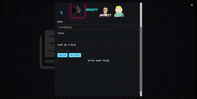

# BootCamp-Journal 📓 ✍️

## Description 
Bootcamp Journal is a platform designed to facilitate creative writing and self-reflection for users, providing a structured outlet to articulate goals, thoughts, and reflections. Users have an option to select a GIF or look up a word to help them craft their journal entry. 

Motivation: The primary aim of Bootcamp Journal is to aid users in organizing their thoughts and tracking progress while participating in academic bootcamps. Bootcamps offer intensive learning experiences condensed into short periods, making it crucial to have a tool for managing the learning process effectively.

Project purpose: Users can input journal entries and utilize the platform to enhance their mental well-being.

Lessons learned: In developing Bootcamp Journal, we acquired proficiency in essential coding languages such as HTML, CSS, JavaScript, and API integration. Additionally, we honed our skills in project and time management, recognizing the significance of efficient task organization in achieving project objectives.

## Table of Contents
- [Installation](#installation)
- [Usage](#usage)
- [Credits](#credits)
- [License](#license)

## Technology Used

HTML, CSS, Javascript, Bulma, AnimeJS
APIs: Giphy, Dictionary, DataMUSE

To get started:

1. Access the live link
2. Hover over the 'Add' tab and click on it   
3. Module will pop-out and ask for user inputs to create your journal entry
4. The 'Previous Entries' will display all of your past posts
5. The 'Resources' tab will direct you to a resource page

Live Link: https://odesii.github.io/bootcamp-journal/

## Usage

## Credits 
[Alic(https://github.com/Odesii)]
[Gabriela(https://github.com/GaviDev8)]
[Nick(https://github.com/nbruggeman92)]

## License 
MIT License
---